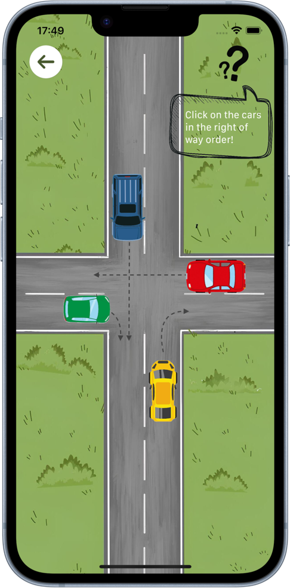
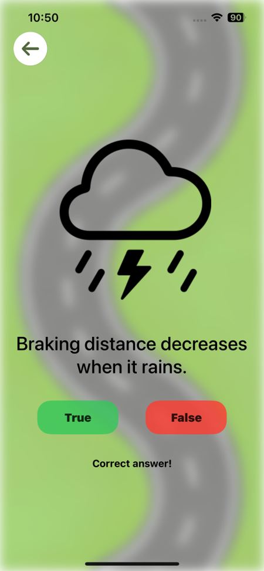
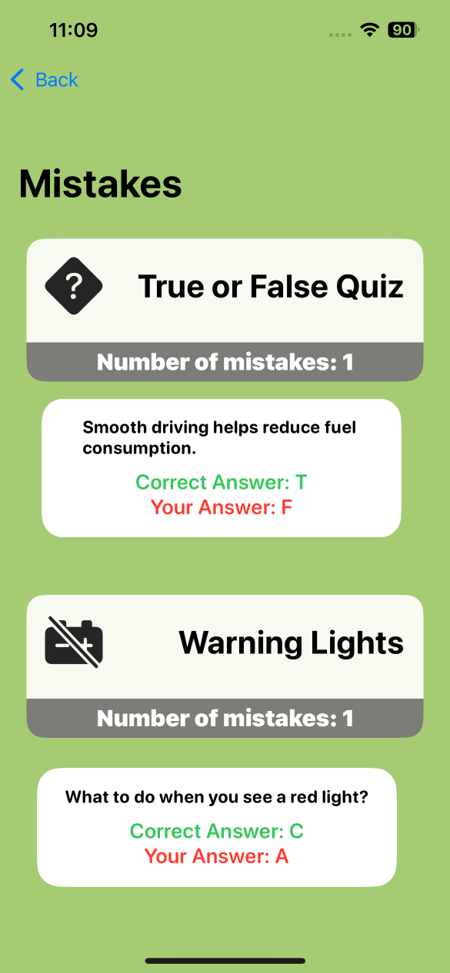

# Way To Go

Way To Go is an application designed to simplify and make learning the topics necessary to pass the driving license test more effective.

## Goals

* Provide an intuitive and easy-to-use user interface.
* Offer clear and concise educational content, divided by topic.
* Include quizzes and exam simulations to test preparation.
* Track user progress and identify areas for improvement.
* Make learning driving theory an engaging and interactive experience.

## Screenshots

    
    
    

## Used Technologies

* [SwiftUI]
* [SpriteKit]
